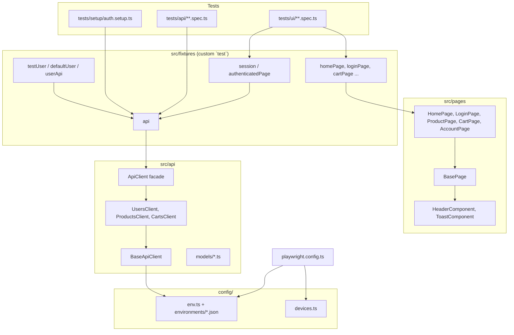
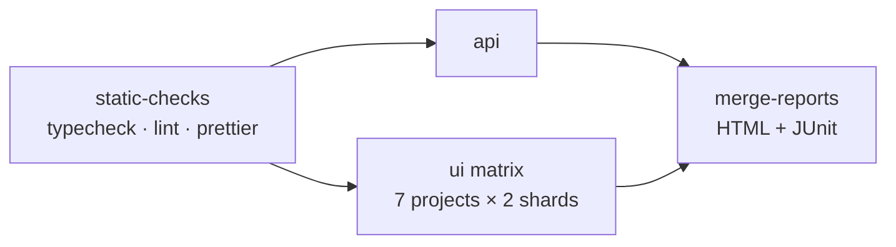

# Test Automation Framework Guide

Playwright + TypeScript framework for web application testing on desktop and mobile viewports,
with an API layer for test-data preparation, multi-environment configuration, multi-browser
execution and parallel runs.

> **No target application yet?** The framework is currently pointed at a public demo web shop
> (Toolshop, `practicesoftwaretesting.com`) so that every layer can be executed and verified
> today. Everything specific to that app is isolated in a handful of files — see
> [Adapting the framework to your application](#12-adapting-the-framework-to-your-application).

---

## Table of contents

1. [Technology stack](#1-technology-stack)
2. [Architecture overview](#2-architecture-overview)
3. [Project structure](#3-project-structure)
4. [Getting started](#4-getting-started)
5. [Configuration & environments](#5-configuration--environments)
6. [Browsers, devices & mobile viewports](#6-browsers-devices--mobile-viewports)
7. [Parallel execution](#7-parallel-execution)
8. [Running tests](#8-running-tests)
9. [Writing tests](#9-writing-tests)
10. [API layer & test data](#10-api-layer--test-data)
11. [Reporting & debugging](#11-reporting--debugging)
12. [Adapting the framework to your application](#12-adapting-the-framework-to-your-application)
13. [CI/CD](#13-cicd)
14. [Coding conventions & best practices](#14-coding-conventions--best-practices)
15. [Troubleshooting](#15-troubleshooting)

---

## 1. Technology stack

| Technology                                                                      | Version              | Purpose                                                                                                                 |
| ------------------------------------------------------------------------------- | -------------------- | ----------------------------------------------------------------------------------------------------------------------- |
| [Playwright Test](https://playwright.dev)                                       | 1.63                 | Test runner, browser automation (Chromium/Firefox/WebKit), device emulation, API request context, tracing and reporting |
| [TypeScript](https://www.typescriptlang.org/)                                   | 6.x                  | Static typing for page objects, API models and fixtures                                                                 |
| [Node.js](https://nodejs.org)                                                   | ≥ 20 (`.nvmrc` → 22) | Runtime                                                                                                                 |
| [zod](https://zod.dev)                                                          | 4.x                  | Runtime validation of environment configuration — misconfiguration fails fast with a readable message                   |
| [dotenv](https://github.com/motdotla/dotenv)                                    | 17.x                 | Loads a local, git-ignored `.env` with secrets/overrides                                                                |
| [@faker-js/faker](https://fakerjs.dev)                                          | 10.x                 | Realistic random test data (users, addresses)                                                                           |
| [ESLint](https://eslint.org) + `typescript-eslint` + `eslint-plugin-playwright` | 10.x / 8.x / 2.x     | Static analysis incl. Playwright-specific rules (no floating promises, no `waitForTimeout`, etc.)                       |
| [Prettier](https://prettier.io)                                                 | 3.x                  | Formatting                                                                                                              |
| GitHub Actions                                                                  | —                    | CI: lint/typecheck → API tests → UI matrix (7 device profiles × 2 shards) → merged HTML report                          |

Why Playwright: one runner covers all three browser engines, ships real mobile device descriptors
(user agent, DPR, touch, viewport), has a built-in HTTP client for the API layer, first-class
parallelism/sharding, and a trace viewer for post-mortem debugging.

---

## 2. Architecture overview



Layers, bottom-up:

- **Config** — `config/env.ts` resolves `TEST_ENV` → JSON file → env-var overrides and validates the
  result. `config/devices.ts` declares the browser/device matrix. `playwright.config.ts` turns both
  into Playwright projects.
- **API layer** — typed clients around Playwright's `APIRequestContext`. Used by tests for data
  preparation (users, carts) and by the `api` project for pure API tests.
- **Page objects** — encapsulate locators and user actions per page/component. Responsive
  differences (hamburger menu, collapsed filters) are handled _inside_ page objects so tests are
  device-agnostic.
- **Fixtures** — compose everything into a single `test` object. Tests never instantiate page
  objects or clients themselves.
- **Tests** — thin, readable specs: arrange via API, act via page objects, assert with web-first
  assertions.

---

## 3. Project structure

```
.
├── .github/workflows/playwright.yml   CI pipeline (lint → api → ui matrix → merged report)
├── config/
│   ├── env.ts                         Environment loader + zod validation (TEST_ENV, overrides)
│   ├── devices.ts                     Browser / device / viewport matrix → Playwright projects
│   └── environments/
│       ├── dev.json                   Per-environment URLs, timeouts, retries, feature flags
│       ├── staging.json
│       └── prod.json
├── src/
│   ├── api/
│   │   ├── api-client.ts              Facade: api.users / api.products / api.carts + shared auth token
│   │   ├── core/base-client.ts        HTTP wrapper: base URL, bearer auth, status validation, logging, test.step
│   │   ├── core/api-error.ts          Rich error (method, url, status, body)
│   │   ├── clients/*.client.ts        One client per backend resource
│   │   └── models/*.model.ts          Request/response types
│   ├── pages/
│   │   ├── base.page.ts               goto()/expectLoaded(), header & toast, mobile detection
│   │   ├── components/                Reusable UI fragments (header with hamburger logic, toasts)
│   │   └── *.page.ts                  One class per page
│   ├── fixtures/
│   │   ├── api.fixture.ts             `api`
│   │   ├── user.fixture.ts            `testUser`, `userApi`, worker-scoped `defaultUser`
│   │   ├── session.fixture.ts         `session.loginAs()`, `session.seedCart()`, `authenticatedPage`
│   │   ├── pages.fixture.ts           Page objects as fixtures
│   │   └── index.ts                   `import { test, expect } from '@fixtures'`
│   ├── data/
│   │   ├── factories/user.factory.ts  Faker-based payload builders
│   │   ├── test-users.ts              createTestUser(api) – canonical way to get a user
│   │   └── test-data.ts               Static constants, tags, breakpoints
│   └── utils/                         logger, paths, helpers (retry, uniqueSuffix, parsePrice)
├── tests/
│   ├── setup/auth.setup.ts            Runs before UI projects: health check + provisions default user
│   ├── api/*.api.spec.ts              Pure API tests (no browser)
│   └── ui/**/*.spec.ts                UI tests, grouped by feature
├── docs/GUIDE.md                      This guide
├── playwright.config.ts
├── tsconfig.json                      Strict TS + path aliases (@api, @pages, @fixtures, ...)
├── eslint.config.mjs, .prettierrc
├── .env.example                       Template for local overrides / secrets
└── package.json                       npm scripts
```

Generated (git-ignored): `reports/` (HTML/JUnit/JSON/blob), `test-results/` (traces, screenshots,
videos), `.auth/` (provisioned default user per environment).

---

## 4. Getting started

```bash
# 1. Node 20+ (nvm users: `nvm use` picks up .nvmrc)
node --version

# 2. Install dependencies and browsers
npm ci
npx playwright install --with-deps   # chromium, firefox, webkit (+ OS deps on Linux)

# 3. Optional local overrides
cp .env.example .env                 # edit TEST_ENV, HEADLESS, LOG_LEVEL, credentials …

# 4. Sanity run
npm run test:api                     # fast, no browser
npm run test:chromium                # UI on desktop Chromium
npm run report                       # open the HTML report
```

---

## 5. Configuration & environments

### 5.1 Selecting an environment

`TEST_ENV` picks `config/environments/<TEST_ENV>.json` (default `staging`):

```bash
TEST_ENV=dev npx playwright test
npm run test:prod
```

An unknown value fails immediately:
`Error: Unknown TEST_ENV="nope". Supported values: dev, staging, prod`.

### 5.2 Environment file schema

```json
{
  "name": "staging",
  "baseUrl": "https://practicesoftwaretesting.com",
  "apiBaseUrl": "https://api.practicesoftwaretesting.com",
  "timeouts": { "test": 60000, "action": 15000, "navigation": 30000, "expect": 10000 },
  "retries": 1,
  "ignoreHttpsErrors": false,
  "features": { "socialLogin": true }
}
```

| Field               | Used for                                                                     |
| ------------------- | ---------------------------------------------------------------------------- |
| `baseUrl`           | `page.goto('/relative')`, UI projects                                        |
| `apiBaseUrl`        | API clients and the `api` project                                            |
| `timeouts.*`        | Playwright `timeout`, `actionTimeout`, `navigationTimeout`, `expect.timeout` |
| `retries`           | Playwright `retries` (typically 0 locally/dev, 1–2 for shared envs)          |
| `ignoreHttpsErrors` | Self-signed certificates on internal environments                            |
| `features`          | Feature flags you can read in tests: `config.features.socialLogin`           |

Files are validated by zod (`config/env.ts`); a typo in a key or an invalid URL produces a
precise error at startup instead of a confusing failure mid-run.

### 5.3 Resolution order (highest wins)

1. Process environment variables — `BASE_URL`, `API_BASE_URL`, `RETRIES`, `HEADLESS`, `WORKERS`,
   `LOG_LEVEL`, `ADMIN_EMAIL`, `ADMIN_PASSWORD`, `CI`
2. `.env` file (git-ignored, loaded by dotenv)
3. `config/environments/<TEST_ENV>.json`

Example — run the staging suite against a feature branch deployment without editing any file:

```bash
TEST_ENV=staging BASE_URL=https://feature-123.example.com npx playwright test --project=chromium-desktop
```

### 5.4 Secrets

Never commit credentials. Put them in `.env` locally and in CI secrets remotely. When
`ADMIN_EMAIL`/`ADMIN_PASSWORD` are set, the setup project validates and uses that account as
`defaultUser`; otherwise it provisions a fresh one via the API. The logger redacts any field
whose name matches `password|token|secret|authorization`.

### 5.5 Adding an environment

1. Create `config/environments/<name>.json` following the schema.
2. Add `<name>` to `SUPPORTED_ENVS` in `config/env.ts`.
3. (Optional) add a `test:<name>` script in `package.json` and the option in the CI workflow input.

---

## 6. Browsers, devices & mobile viewports

The matrix lives in `config/devices.ts`; every entry becomes a Playwright project.

| Project                  | Engine   | Form factor | Viewport     | Notes                                           |
| ------------------------ | -------- | ----------- | ------------ | ----------------------------------------------- |
| `chromium-desktop`       | Chromium | desktop     | 1440×900     |                                                 |
| `firefox-desktop`        | Firefox  | desktop     | 1440×900     |                                                 |
| `webkit-desktop`         | WebKit   | desktop     | 1440×900     | Safari engine                                   |
| `mobile-chrome-pixel7`   | Chromium | mobile      | 412×915 @2.6 | Real Pixel 7 descriptor (UA, touch, `isMobile`) |
| `mobile-safari-iphone14` | WebKit   | mobile      | 390×664 @3   | Real iPhone 14 descriptor                       |
| `mobile-small-320`       | Chromium | mobile      | 320×568 @2   | Custom: smallest supported breakpoint           |
| `tablet-ipad`            | WebKit   | tablet      | 810×1080 @2  | iPad (gen 7)                                    |
| `api`                    | —        | —           | —            | No browser; `baseURL = apiBaseUrl`              |
| `setup`                  | —        | —           | —            | Dependency of all UI projects                   |

### 6.1 Adding a device or custom screen size

```ts
// config/devices.ts
{
  name: 'mobile-galaxy-s9',
  engine: 'chromium',
  formFactor: 'mobile',
  use: { ...devices['Galaxy S9+'] },           // any built-in descriptor …
},
{
  name: 'mobile-custom-360',
  engine: 'chromium',
  formFactor: 'mobile',
  use: { ...devices['Pixel 7'], viewport: { width: 360, height: 740 } },   // … or a custom viewport
},
```

List all built-in descriptors: `node -e "console.log(Object.keys(require('@playwright/test').devices))"`.

### 6.2 Writing device-agnostic tests

Responsive behaviour is encapsulated in page objects:

- `header.openNavigationIfCollapsed()` — opens the hamburger menu only when it is present.
- `homePage.openFiltersIfCollapsed()` — expands the filter sidebar on narrow screens.
- `header.loggedInUserName()`, `header.goToSignIn()`, `header.goToCart()` — already handle both layouts.

When an assertion is only valid for a form factor, skip by **viewport width** (not by `isMobile`,
which is also `true` for tablets):

```ts
import { BREAKPOINTS } from '@data/test-data';

test('filters collapse below md', async ({ homePage, viewport }) => {
  test.skip((viewport?.width ?? Infinity) >= BREAKPOINTS.md, 'Filters are expanded at this width');
  // ...
});
```

Project metadata is also available: `testInfo.project.metadata.formFactor` (`'desktop' | 'mobile' | 'tablet'`).

---

## 7. Parallel execution

- `fullyParallel: true` — every test (not just every file) can run in its own worker.
- Workers default to Playwright's heuristic (half the CPU cores) locally and `50%` on CI. Override
  with `WORKERS=4` or `--workers=4` (`WORKERS=1` / `npm run test:serial` for debugging).
- Projects run in parallel too: `--project=chromium-desktop --project=mobile-chrome-pixel7`.
- Sharding across CI machines: `npx playwright test --shard=1/4`; the `blob` reporter output is
  merged into one HTML report (see CI workflow).

### Designing for parallelism

- **No shared mutable state.** Tests that mutate account data use the per-test `testUser`; the
  worker-scoped `defaultUser` is read-only.
- **Unique data.** Factories append `uniqueSuffix()` to emails/names, so two workers never collide.
- **Isolated browser context per test** (Playwright default) plus a separate `APIRequestContext`
  per fixture — cookies/tokens never leak between UI and API layers.
- Use `test.describe.configure({ mode: 'serial' })` only for genuinely ordered flows.

---

## 8. Running tests

| Command                                                  | What it does                                |
| -------------------------------------------------------- | ------------------------------------------- |
| `npm test`                                               | Everything: setup → API → all 7 UI projects |
| `npm run test:api`                                       | API project only (fastest feedback)         |
| `npm run test:ui`                                        | All UI projects                             |
| `npm run test:desktop`                                   | Chromium + Firefox + WebKit desktop         |
| `npm run test:mobile`                                    | Pixel 7 + iPhone 14 + 320px + iPad          |
| `npm run test:chromium` / `test:firefox` / `test:webkit` | One desktop engine                          |
| `npm run test:smoke` / `test:regression`                 | Filter by tag                               |
| `npm run test:dev` / `test:staging` / `test:prod`        | Pick an environment                         |
| `npm run test:headed` / `test:debug`                     | Watch the browser / Playwright Inspector    |
| `npm run test:serial`                                    | One worker                                  |
| `npm run report`                                         | Open the last HTML report                   |
| `npm run codegen`                                        | Record locators against the app             |
| `npm run typecheck` / `lint` / `format`                  | Quality gates                               |

Composable CLI examples:

```bash
# Smoke tests, mobile Safari only, against dev, headed
TEST_ENV=dev npx playwright test --project=mobile-safari-iphone14 --grep @smoke --headed

# One spec on two projects
npx playwright test tests/ui/cart/cart.spec.ts --project=chromium-desktop --project=mobile-small-320

# Everything except desktop-only tests
npx playwright test --grep-invert @desktop-only

# Re-run only what failed last time
npx playwright test --last-failed
```

### Tags

Declared in `src/data/test-data.ts` and attached via `test(..., { tag: '@smoke' })` or
`test.describe(..., { tag: [...] })`:

| Tag                                         | Meaning                           |
| ------------------------------------------- | --------------------------------- |
| `@smoke`                                    | Critical path, runs on every PR   |
| `@regression`                               | Full functional coverage, nightly |
| `@api`                                      | API-only tests                    |
| `@mobile`                                   | Responsive-layout tests           |
| `@desktop-only`                             | Only meaningful on wide viewports |
| feature tags (`@auth`, `@cart`, `@catalog`) | Slice by area                     |

---

## 9. Writing tests

### 9.1 Anatomy of a UI test

```ts
import { test, expect } from '@fixtures';

test.describe('Shopping cart', { tag: ['@cart'] }, () => {
  test(
    'cart page reflects a cart prepared via API',
    { tag: '@smoke' },
    async ({ session, cartPage, api }) => {
      // Arrange – through the API, not the UI
      const product = await api.products.findAvailable();
      await session.seedCart([{ product_id: product.id, quantity: 2 }]);

      // Act – through page objects
      await cartPage.goto();

      // Assert – web-first assertions auto-wait and retry
      await expect(cartPage.productTitles).toHaveText([product.name]);
      await expect(cartPage.header.cartQuantity).toHaveText('2');
    },
  );
});
```

### 9.2 Available fixtures

| Fixture                                                           | Scope  | Description                                                                                       |
| ----------------------------------------------------------------- | ------ | ------------------------------------------------------------------------------------------------- |
| `api`                                                             | test   | Unauthenticated `ApiClient` for the current environment                                           |
| `testUser`                                                        | test   | Fresh user created via API for this test — use when the test mutates account state                |
| `userApi`                                                         | test   | `ApiClient` authenticated as `testUser`                                                           |
| `defaultUser`                                                     | worker | Shared read-only user provisioned by the setup project (falls back to creating one)               |
| `session`                                                         | test   | `loginAs(user)` injects an API-obtained token into the browser; `seedCart(items)` prepares a cart |
| `authenticatedPage`                                               | test   | `page` already logged in as `defaultUser`                                                         |
| `homePage`, `loginPage`, `productPage`, `cartPage`, `accountPage` | test   | Page objects                                                                                      |
| Playwright built-ins                                              | —      | `page`, `context`, `browser`, `request`, `viewport`, `isMobile`, `browserName` …                  |

### 9.3 Adding a page object

```ts
// src/pages/checkout.page.ts
import type { Locator, Page } from '@playwright/test';
import { BasePage } from './base.page';

export class CheckoutPage extends BasePage {
  protected readonly path = '/checkout';
  readonly paymentMethod: Locator;
  readonly confirmButton: Locator;

  constructor(page: Page) {
    super(page);
    this.paymentMethod = page.getByTestId('payment-method');
    this.confirmButton = page.getByTestId('finish');
  }

  protected readyLocator(): Locator {
    return this.paymentMethod;
  }

  async pay(method: string): Promise<void> {
    await this.paymentMethod.selectOption(method);
    await this.confirmButton.click();
  }
}
```

Then expose it in `src/pages/index.ts` and `src/fixtures/pages.fixture.ts`.

Rules of thumb:

- Expose `Locator`s and actions; keep assertions in tests (`expectLoaded()` is the exception).
- Locator priority: `getByTestId` (mapped to `data-test` via `testIdAttribute`) → `getByRole` /
  `getByLabel` → CSS. Avoid XPath and text that is translated.
- Handle responsive differences inside the page object, never in the test.
- No `waitForTimeout`. Wait on locators/assertions; ESLint flags violations.

### 9.4 Skipping / focusing

```ts
test.skip(browserName === 'webkit', 'Upload not supported in WebKit build');
test.fixme(true, 'Blocked by BUG-123');
test.describe.configure({ mode: 'serial' }); // ordered flows only
```

---

## 10. API layer & test data

### 10.1 Using clients

```ts
const products = await api.products.list({ sort: 'price,asc' });
const product = await api.products.findAvailable('hammer');

await api.authenticate({ email, password }); // token shared by all sub-clients
const me = await api.users.me();
const cartId = await api.carts.create();
await api.carts.addItem(cartId, { product_id: product.id, quantity: 1 });
```

Every call is wrapped in a `test.step('API GET /products')` so it appears in the HTML report and
trace. Unexpected status codes raise `ApiError` with method, URL, status and body:

```ts
await expect(api.users.login(INVALID_CREDENTIALS)).rejects.toMatchObject({ status: 401 });
```

### 10.2 Adding a client

```ts
// src/api/clients/orders.client.ts
export class OrdersClient extends BaseApiClient {
  async create(payload: CreateOrderRequest): Promise<Order> {
    return this.post<Order>('/orders', payload, { expectedStatus: 201 });
  }
}
```

Register it in `ApiClient` (constructor + `clients` tuple so it receives the auth token) and
export from `src/api/index.ts`. Add request/response types under `src/api/models/`.

### 10.3 Test data strategy

| Kind                                 | Where                             | Example                                     |
| ------------------------------------ | --------------------------------- | ------------------------------------------- |
| Static, environment-independent      | `src/data/test-data.ts`           | search terms, tags, breakpoints             |
| Generated payloads                   | `src/data/factories/*.factory.ts` | `buildRegisterUser({ email })`              |
| Backend state (users, carts, orders) | created at runtime via API        | `createTestUser(api)`, `session.seedCart()` |

Never hard-code IDs or accounts that exist only in one environment.

### 10.4 Authentication without UI login

The UI login itself is covered by dedicated tests. Everything else uses
`session.loginAs(user)` / `authenticatedPage`, which

1. calls `POST /users/login` through the API,
2. registers a `context.addInitScript` that writes the token into the browser's Web Storage before
   the SPA boots (guarded by a marker key so a subsequent sign-out is not undone).

This is ~10× faster than driving the login form and independent of UI changes.

---

## 11. Reporting & debugging

| Artifact    | Local                             | CI                                                    |
| ----------- | --------------------------------- | ----------------------------------------------------- |
| HTML report | `reports/html` (opens on failure) | merged from blob shards, uploaded as `html-report`    |
| JUnit       | —                                 | `reports/junit/results.xml` → `junit-report` artifact |
| JSON        | —                                 | `reports/json/results.json`                           |
| Trace       | on first retry                    | retained on failure                                   |
| Screenshot  | on failure                        | on failure                                            |
| Video       | off                               | retained on failure                                   |

```bash
npm run report                                   # open HTML report
npx playwright show-trace test-results/<test>/trace.zip
npx playwright test --trace on --project=chromium-desktop -g "sign out"
npm run test:debug -- -g "sign out"              # Playwright Inspector, step through
LOG_LEVEL=debug npx playwright test --project=api # log every API request/response
```

Each failure also produces `error-context.md` (an accessibility snapshot of the page at the moment
of failure) next to the screenshot — often enough to diagnose without opening the trace.

---

## 12. Adapting the framework to your application

The demo target is a placeholder. To point the framework at your product:

1. **Environments** — replace `baseUrl` / `apiBaseUrl` (and timeouts) in
   `config/environments/*.json`. Rename or add environments as described in §5.5.
2. **Test-id attribute** — set `use.testIdAttribute` in `playwright.config.ts` to whatever your
   front-end uses (`data-testid`, `data-qa`, …). Agree with developers that interactive elements
   carry a stable test id.
3. **API layer** — replace `src/api/clients/*` and `src/api/models/*` with your backend's
   resources. `BaseApiClient` is generic; only override `setToken`/header logic if your API uses
   something other than `Authorization: Bearer`.
4. **Session injection** — update `STORAGE_KEYS` in `src/fixtures/session.fixture.ts` to the keys
   your SPA reads on boot (or switch to cookie-based `storageState` if the session is a cookie:
   `context.storageState({ path })` in `auth.setup.ts` and `use: { storageState }` in projects).
5. **Setup project** — adjust `tests/setup/auth.setup.ts` to provision/validate whatever a
   logged-in user needs in your system.
6. **Page objects & tests** — replace `src/pages/*` and `tests/ui/*` with your pages. Keep the
   patterns: `BasePage`, components for shared UI (header/nav), responsive handling inside page
   objects.
7. **Factories** — adapt `src/data/factories/*` to your domain's payloads.
8. **Device matrix** — trim or extend `config/devices.ts` to the devices your product supports.
9. **CI** — update the `project` matrix in `.github/workflows/playwright.yml` to match and add
   `TEST_ENV`-specific secrets.

Everything else (config loader, fixtures chain, base client, logger, reporting, CI skeleton) is
application-agnostic.

---

## 13. CI/CD

`.github/workflows/playwright.yml`:



- Triggers: push/PR to `main`, nightly schedule (full regression on staging), manual
  `workflow_dispatch` with `test_env` and `grep` inputs (e.g. run `@smoke` on `prod`).
- Each UI job installs browsers with `--with-deps`, runs one project shard, uploads its blob
  report; `merge-reports` produces a single HTML report and JUnit file.
- Environment variables: `CI=true` switches reporters, `retain-on-failure` traces/videos and
  `forbidOnly`. Secrets (`ADMIN_EMAIL`, …) are injected via repository secrets.

Adapting to another CI (GitLab, Azure, Jenkins) only requires the same three commands:
`npm ci` → `npx playwright install --with-deps` → `npx playwright test --project=… --shard=…`.

---

## 14. Coding conventions & best practices

- **Strict TypeScript** with path aliases (`@fixtures`, `@pages/*`, `@api/*`, `@data/*`,
  `@utils/*`, `@config/*`). Run `npm run typecheck` before pushing.
- **ESLint** enforces `no-floating-promises`, type-only imports and Playwright rules
  (`no-wait-for-timeout`, `no-force-option`, `prefer-web-first-assertions`, …).
- **Prettier** formats everything (`npm run format`).
- **Test naming**: describe the behaviour, not the steps — `'user can sign out'`, not
  `'click sign out button'`.
- **One behaviour per test**; prefer several small tests over one long journey.
- **Arrange via API, act via UI, assert via web-first assertions.**
- **Web-first assertions only** (`await expect(locator).toHaveText()`); use `expect.poll` for
  derived values.
- **Independence**: no test relies on another test's side effects or on execution order.
- **Deterministic data**: unique suffixes, factories, no environment-specific constants.
- **Cleanup**: when the backend allows deletion, clean up in the fixture teardown (after `use()`),
  not in the test body.

---

## 15. Troubleshooting

| Symptom                                            | Cause / fix                                                                                                                                       |
| -------------------------------------------------- | ------------------------------------------------------------------------------------------------------------------------------------------------- |
| `Unknown TEST_ENV="…"`                             | Typo or missing entry in `SUPPORTED_ENVS` (`config/env.ts`)                                                                                       |
| `Invalid environment file …` with zod details      | Fix the listed field in the JSON                                                                                                                  |
| `Executable doesn't exist`                         | `npx playwright install --with-deps`                                                                                                              |
| `page.goto: Timeout … waiting until "load"`        | `BasePage.goto` waits for `commit` + `readyLocator()` on purpose (third-party scripts delay `load`); use page objects rather than raw `page.goto` |
| `defaultUser` warning "metadata not found"         | You ran a UI project without its `setup` dependency (e.g. `--no-deps`); a worker-scoped user is created instead — harmless                        |
| Tests pass on desktop, fail on mobile              | Element hidden in collapsed nav/filters — use the `*IfCollapsed()` helpers or skip by `viewport.width`                                            |
| `strict mode violation`                            | Locator matches several elements; scope it (`filter({ has })`, `nth()`, test id)                                                                  |
| Flaky in parallel only                             | Shared data between tests — switch to `testUser` / unique factory data                                                                            |
| `dev` (with-bugs) environment fails some API tests | That environment intentionally contains bugs (e.g. numeric product IDs); this is the framework doing its job                                      |
